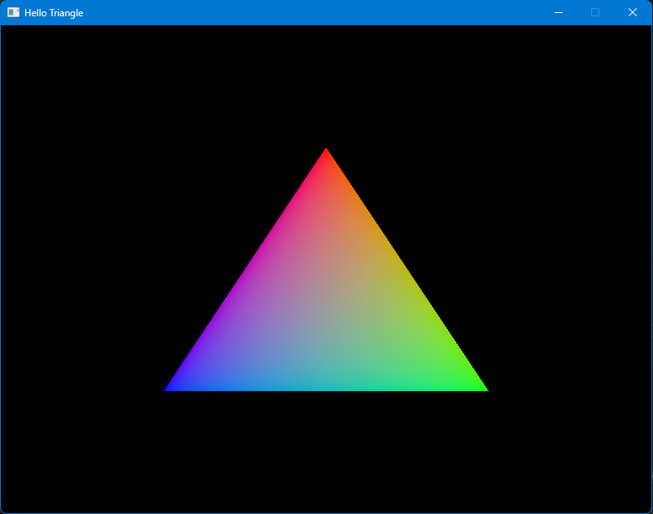

# Vulkan Tutorial

Learning how to use the Vulkan API

## Resources

* [Vulkan](https://vulkan.org/)
* [Vulkan Tutorial](https://vulkan-tutorial.com)
* [Vulkan Documentation](https://docs.vulkan.org/spec/latest/index.html)
* [Vulkan Specification](https://registry.khronos.org/vulkan/specs/latest/html/vkspec.html)
* [Vulkan API Reference](https://registry.khronos.org/vulkan/specs/latest/man/html/)

Built using _[premake5](https://premake.github.io)_

## Projects

1. **[Hello Triangle](HelloTriangle)** - 
Followed the tutorial at [Vulkan Tutorial](https://vulkan-tutorial.com) to draw a triangle.

